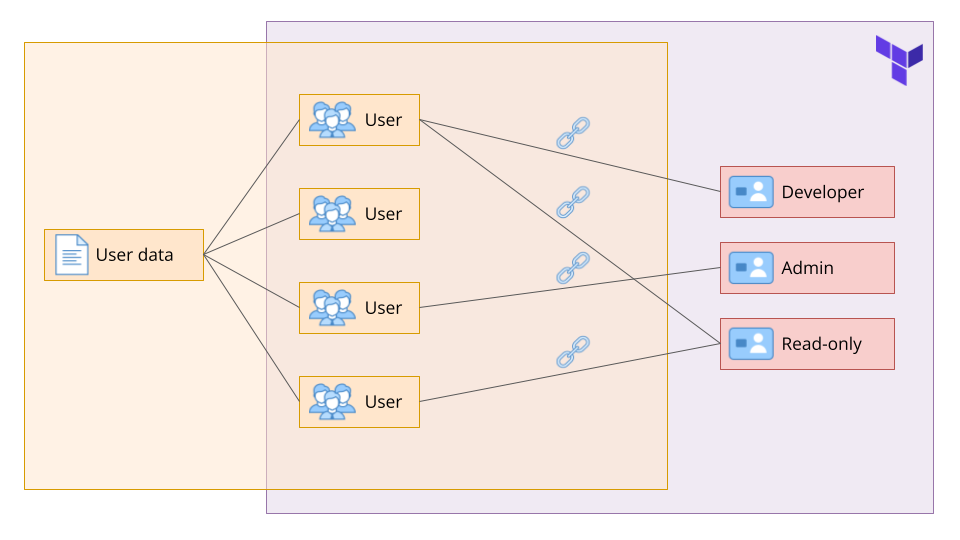

# IAM Project 🔐

[](https://www.terraform.io) [](https://github.com) [](https://choosealicense.com)

## Managing IAM Users and Roles with Terraform

This project is centered around managing AWS Identity and Access Management (IAM) users and roles using Terraform and YAML. The primary objective is to automate the process of creating users, assigning roles, and ensuring secure role assignment. User information, including usernames and roles, will be stored in a YAML file, while role information will be managed in Terraform. An important aspect of this project is to ensure that roles can only be assumed by the users assigned to them, adding an extra layer of security.

## Project Overview



## Quick start (clone the repo)

1. Clone the repository and enter the IAM project directory:

```bash
git clone <REPO_URL> iam-project
cd iam-project
```

2. Initialize and preview changes:

```bash
terraform init
terraform plan -out=plan.tfplan
terraform apply "plan.tfplan"
```

3. Tear down when finished:

```bash
terraform destroy
```

> Tip: Replace `<REPO_URL>` and `<repo-name>` with the repository URL and directory name.

## Project purpose

This example demonstrates a pattern: using a declarative YAML file (`users-roles.yaml`) as the single source of truth to map users to roles. The mapping controls which principals appear in role trust policies and which managed policies are attached to each role.

## Contents & hierarchy

| Component | Purpose | Notes |
|---|---|---|
| `users-roles.yaml` | Source of truth for users and their roles | Edit this file to change assignments |
| `users.tf` | Creates IAM users & login profiles | Reads `users-roles.yaml` via `yamldecode(file(...))` |
| `roles.tf` | Creates roles, trust policies, and attachments | Reads `roles_policies` locals and builds policies/attachments |
| `provider.tf` | AWS provider configuration | Set credentials and region here |
| `outputs.tf` | Exposes values after apply | e.g., generated passwords or ARNs |

## Example

`users-roles.yaml` sample:

```yaml
users:
  - username: john
	roles: [readonly, developer]
  - username: jane
	roles: [admin, auditor]
```

## Security & notes

- This is an example; review and adapt IAM design before using in production.
- State files in this folder are local; consider a remote backend for team usage.
